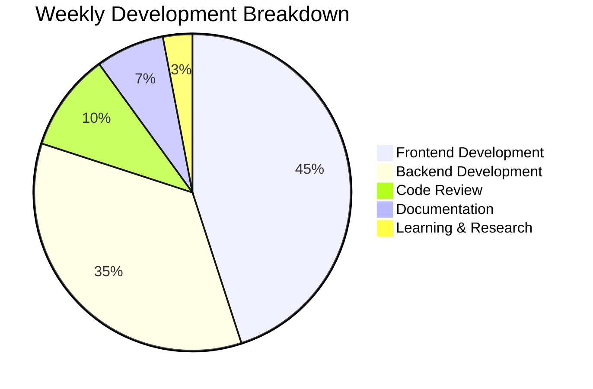

<!-- markdownlint-disable MD033 MD041 MD026 -->
<div align="center">
  
  
  

  <div align="center" style="margin-top: 10px;">
    
    
    
  </div>

  <p align="center" style="margin-top: 15px;">
    <a href="https://full-stack-developer-vhne.vercel.app" target="_blank">
      
    </a>
    <a href="https://www.linkedin.com/in/sameershoukat-fullstack-javascript-developer/" target="_blank">
      
    </a>
    <a href="mailto:sameer_shoukat@outlook.com">
      
    </a>
  </p>
</div>

---

## 🎯 About Me

<div align="center">
  
```typescript
interface Developer {
  name: "Sameer Shoukat";
  location: "Lahore, Pakistan 🇵🇰";
  role: "Full Stack Engineer";
  experience: "4+ years";
  company: {
    current: "@sonder-blu";
    role: "React/React Native Developer";
    focus: "High-performance SaaS platforms";
  };
  
  technicalFocus: {
    frontend: ["React", "Next.js", "TypeScript", "React Native"];
    backend: ["Node.js", "Express", "NestJS", "MongoDB"];
    state: ["Redux", "Context API", "Zustand"];
    styling: ["TailwindCSS", "Styled Components", "Material-UI"];
  };
  
  philosophy: "Build scalable, maintainable, and user-centric applications";
  currentlyLearning: ["System Design", "Cloud Architecture", "Microservices"];
  funFact: "I turn coffee ☕ into code 💻";
}
```

</div>

---

## 🛠️ Tech Stack

### **Frontend Development**

<div align="center">
  
</div>

### **Backend & Databases**

<div align="center">
  
</div>

### **Mobile & Cross-Platform**

<div align="center">
  
</div>

### **Tools & DevOps**

<div align="center">
  
</div>

---

## 📊 GitHub Analytics

<div align="center">
  <table>
    <tr>
      <td align="center">
        
      </td>
      <td align="center">
        
      </td>
    </tr>
  </table>
  
  
  
  <!-- Activity Graph -->
  
</div>

---

## 🏆 Featured Projects

<div align="center">
  
| Project | Description | Tech Stack | Status |
|---------|-------------|------------|--------|
| **[SonderBlu](https://github.com/sonder-blu)** | Streaming & Social Platform for Film Enthusiasts | React • Node.js • MongoDB • Firebase | 🚀 Live |
| **Reilukuljetus** | Food Ordering App with Real-time Tracking | React Native • Node.js • Express | 📱 Active |
| **Portfolio V3** | Interactive Developer Portfolio | Next.js 14 • TypeScript • Framer Motion | 🌐 Live |
| **E-Commerce API** | Scalable Backend for E-commerce | NestJS • MongoDB • Redis • JWT | 🔧 Completed |

</div>

---

## 📈 Contribution Metrics

<div align="center">
  


</div>

---

## 🏅 GitHub Trophies

<div align="center">
  
</div>

---

## 🎖️ Certifications & Achievements

<div align="center">
  <table>
    <tr>
      <td align="center">
        
      </td>
      <td align="center">
        
      </td>
      <td align="center">
        
      </td>
    </tr>
  </table>
</div>

---

## 📝 Latest Blog Posts

<!-- BLOG-POST-LIST:START -->
<!-- BLOG-POST-LIST:END -->

---

## 🤝 Collaboration Opportunities

<div align="center">
  
| Type | Status | Looking For |
|------|--------|-------------|
| **Full-time Position** | ✅ Open | Product companies, Tech startups |
| **Freelance Projects** | ✅ Available | Web & Mobile Apps |
| **Open Source** | 🤝 Collaborative | React/Node.js projects |
| **Mentorship** | 💡 Providing | Junior developers |

</div>

---

## 🌐 Connect With Me

<div align="center">
  
[](https://www.linkedin.com/in/sameershoukat-fullstack-javascript-developer/)
[](https://twitter.com/SameerShoukat9)
[](https://stackoverflow.com/users/18160064/sameer-shoukat)
[](https://github.com/Sameer447)
[](https://full-stack-developer-vhne.vercel.app)
[](mailto:sameer_shoukat@outlook.com)

</div>

---

## 📊 Weekly Development Breakdown

```text
TypeScript       ████████████████████░░░░   82.5%
JavaScript       ██████████░░░░░░░░░░░░░░   42.3%
Python           ██████░░░░░░░░░░░░░░░░░░   26.1%
CSS/SCSS         ████░░░░░░░░░░░░░░░░░░░░   18.7%
Other            ██░░░░░░░░░░░░░░░░░░░░░░   10.4%
```

---

<div align="center">
  
### ⚡ **Quick Stats**


</div>

---

<div align="center">
  
**"First, solve the problem. Then, write the code."** – John Johnson

<p align="center">
  
</p>

**Made with ❤️ by Sameer Shoukat**

[](https://github.com/Sameer447)

</div>
